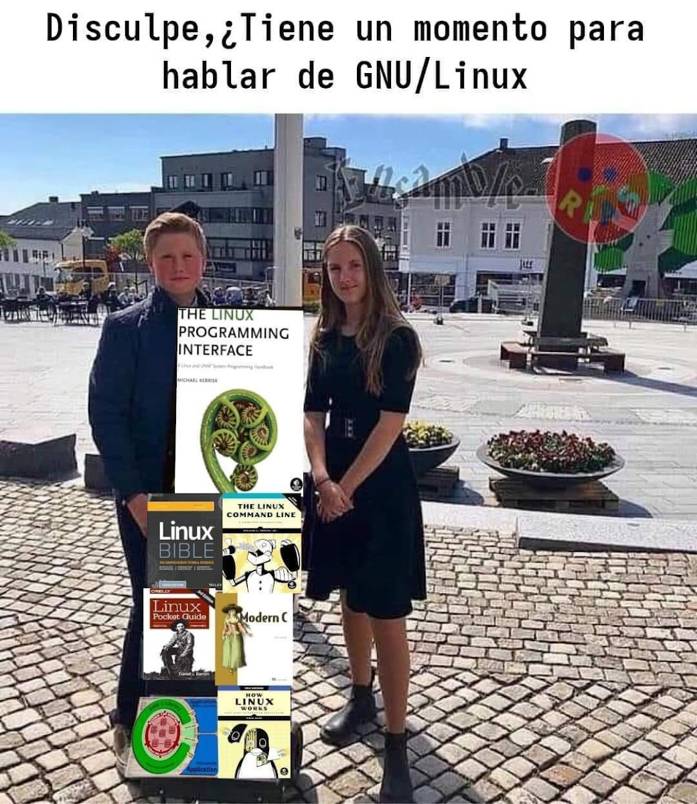

# **Introducción a la Bioinformática: Linux para Ciencias Biológicas**

**¡ Bienvenidos :) !**

En este repositorio encontrarán el material de apoyo para las sesiones. Durante este curso trabajaremos con el sistema operativo Linux, en específico con la distribución Ubuntu mediante el programa [*Windows Subsystem Linux (WSL)*](https://learn.microsoft.com/es-es/windows/wsl/about).

**¡Por favor, es muy importante que tengan instalado el programa para el primer día del curso! El tiempo es corto así que tratemos de aprovecharlo.**

### **Instalación de WSL (*Windows Subsystem for Linux*):**

No pretendo que se vuelvan expertos en Linux hoy, pero si me gustaría que se lleven una noción de como desenvolverse en un entorno con este sistema operativo. Para ello haremos uso de la terminal Linux con una distribución Ubuntu. Si trabajas con un equipo Apple (Mac), no te precupes, en esencia es lo mismo.  Lo más seguro es que tengas Windows y si es el 10 u 11 ¡Vamos de ganando! Solo deberás instalar *WLS (Windows Subsystem for Linux)* para poder ejecutar el Kernel de Linux en tu equipo Windows **(bendito sea el Sr)**. 

Para realizar la instalación de WSL pueden apoyarse de los siguientes recursos:

+ https://youtu.be/0NoFjH1zWSE?si=fo5rje6juU55fCM0 
+ https://learn.microsoft.com/es-es/windows/wsl/install

La distribución Linux que deben descargar prefrentemente es Ubuntu 24.04.1 LTS. El proceso es el mismo que se indica en el vídeo. Por favor, configuren su usuario para que puedan usar la terminal. **La contraseña que pongan será vital para el desarrollo del curson y del uso del sitema operativo, así que no la olviden por favor.**

No duden en escribirme si tienen alguna duda o problema de instalación. Es importante que tengan instalados los programas para el día de la clase, por favor.

---

### **Contacto:**

Biol. Exp. [Jhonatan Raúl Martínez Valderrama](cv_J_Raul_Mtz_Valderrama.pdf); jhonatanraulm@gmail.com ;

+ Posgrado en Ciencias Biológicas, Universidad Nacional Autónoma de México. 
+ Unidad de Investigación en Virología y Cáncer, Hospital Infantil de México, Federico Gómez. 
+ [Grupo de Ciencia Computacional del Hospital Infantil de México, Federico Gómez](https://github.com/Ciencia-Computacional-HIMFG).

---

### **Para seguir aprendiendo**

Chicos, aquí le dejo una serie de recursos 
que les pueden resultar útiles para seguir en este proceso de aprendizaje (muchos de ellos son gratuitos).

+ EMBL's European Bioinformatics Institute: https://www.ebi.ac.uk/

+ Build data and AI skills: https://www.datacamp.com/

+ Plataforma de apoyo y educación en  bionformática: https://atgenomics.com/

+ Escuela de bioinformática: https://www.wintergenomics.com/ 

+ Para aprender más sobre Linux y lenguajes de programación: https://www.netacad.com/

+ Ejercicios de programacíon: https://www.codewars.com/

+ Cursos sobre bionformática: https://www.futurelearn.com/

+ Cursos de bionformática o cualquier tema: https://www.coursera.org/courseraplus?utm_medium=sem&utm_source=gg&utm_campaign=B2C_LATAM__coursera_FTCOF_courseraplus&campaignid=20529999299&adgroupid=156273524587&device=c&keyword=&matchtype=&network=g&devicemodel=&adposition=&creativeid=673242178277&hide_mobile_promo&gclid=Cj0KCQiAj_CrBhD-ARIsAIiMxT-dEtXbKQJbovDipnRUwKCWP9VpjT-c0vDYbbwSqOwAev8dg6FVqjIaApspEALw_wcB
