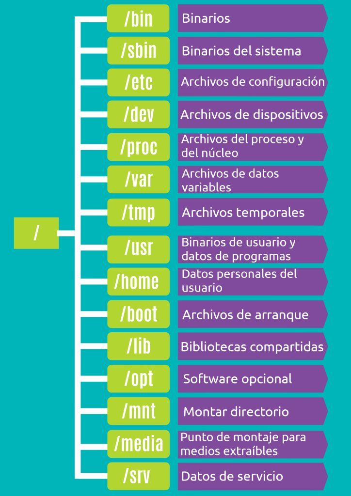
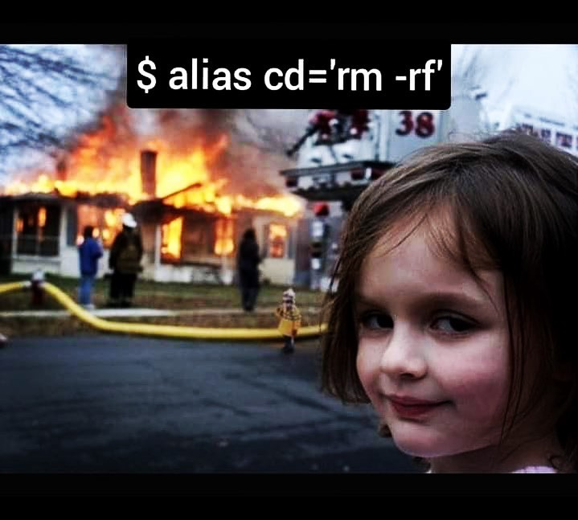

# **La terminal de Linux**

La terminal es una interfaz de línea de comandos (CLI) que permite interactuar con el sistema operativo escribiendo instrucciones en texto. A diferencia de las interfaces gráficas, la terminal es más eficiente para:

+ Procesar archivos grandes.
+ Automatizar tareas con scripts.
+ Conectar con servidores remotos. 

Nota: las salidas que verán son un ejemplo, corresponden a mi equipo y por ende tú tendrás una distinta en comandos que dependen del contexto de la computadora. En esta guía los comandos a ejecutar los verás en una especie de caja, podrás copiarlos y pegarlos directamente en tu computadora. Además, la salida se representa después del signo ">" a manera de ejemplo. Tú verás la salida en tu terminal. 

El objetivo es que se sientan confiados al enfrentarse a un equipo con Linux como sistema operativo. Para ello veremos como movernos en la terminal, generar archivos, ejecutar script's y algunos otros tips que les puedan resultarles útiles. 

**Lo primero que deben saber es lo siguiente: la terminal funciona a través de comandos. Los comandos son instrucciones que el usuario introduce en la terminal para realizar acciones. La estructura básica de un comando es la siguiente:** 

    comando [opciones] [argumentos]
---
    ls -lh /home/
---    
    > total 4.0K
    drwxr-x--- 17 jrmarval jrmarval 4.0K Feb 24 16:36 jrmarval

En esta estructura el comando es la acción a realizar, las opciones modifican el comportamiento del comando y los argumentos representan los elementos sobre los que actuará ese comando.

Ahora, cuando abrimos la terminal entramos a un directorio (directorio=carpeta) pero no sabemos a cual. Entonces, para saber en que directorio nos situamos podemos ejecutar el comando *pwd* el cual **va imprimir el directorio actual de trabajo:**
    
    pwd
---
    > /home/jrmarval 

**Tip:** esto también es útil para especificar rutas en nuestros comandos o scripts.

Para tener un orden en nuestra computadora y en este curso, vamos a crear una carpeta para almacenar todos los archivos que vayamos generando. Para hacer esto usaremos el comando *mkdir*:

    mkdir curso_bioinfo

Cuando corran este comando no verán alguna salida pero el directorio ya fue generado. Si queremos ver los elementos que están en un directorio usamos el comando *ls*

    ls
---
    > [Elementos presentes en el directorio]

    ls -lh
    total 68K

    drwxr-xr-x 7 jrmarval jrmarval 4.0K Jun 11  2024 Bioinfo_Inmunologia2023
    drwxr-xr-x 5 jrmarval jrmarval 4.0K Feb 22 11:36 Cursos_Bioinfo_MARVAL
    drwxr-xr-x 9 jrmarval jrmarval 4.0K Nov  9  2023 RNAseq_uivc
    drwxr-xr-x 5 jrmarval jrmarval 4.0K Nov 19 17:58 Transcriptomics_UIVC
    -rw-r--r-- 1 jrmarval jrmarval  20K Aug 29 23:05 bitacora.md
    drwxr-xr-x 4 jrmarval jrmarval 4.0K Sep 18 15:12 ciencia_computacional
    drwxr-xr-x 2 jrmarval jrmarval 4.0K Feb 24 17:37 curso_bioinfo
    drwxr-xr-x 2 jrmarval jrmarval 4.0K Jan 29 17:45 general
    drwxr-xr-x 2 jrmarval jrmarval 4.0K Jan 23 22:31 linux_cbiol
    drwxr-xr-x 4 jrmarval jrmarval 4.0K Nov  5 22:18 linux_ib
    drwxr-xr-x 6 jrmarval jrmarval 4.0K Sep 24 22:00 rnaseq_ccg
    drwxr-xr-x 4 jrmarval jrmarval 4.0K Feb 17 09:01 scRNAseq_marval
    drwxr-xr-x 7 jrmarval jrmarval 4.0K Nov 21 13:46 test_rnaseq

Como vemos nuestro directorio **curso_bioinfo** fue creado. Ahora para movernos entre directorios usamos el comando *cd*. Veremos que el prompt muestra el nombre del directorio actual de trabajo.

    > (base) jrmarval@LAPTOP-8SI0DC1R:~/marval$
---

    cd curso_bioinfo
---
    > (base) jrmarval@LAPTOP-8SI0DC1R:~/marval/curso_bioinfo$

Si queremos regresar al directorio anterior ejecutamos:

    cd ..
---
    > (base) jrmarval@LAPTOP-8SI0DC1R:~/marval$

Si quisieramos movernos a una ruta en especial podemos indicar la ruta destino en un solo comando:

    cd /rutadestino

**¿Qué pasa cuándo se ejecuta?¿Cúal es la diferencia?**

    cd -
---
    cd --

En esencia, Linux es un conjunto de directorios, en los cuales cada uno de ellos alberga un contenido determinado para el sistema operativo. La [estructura de directorios en Linux](https://itsfoss.com/es/estructura-directorios-linux/) es la siguiente:

En programación es usual hablar de rutas absolutas y relativas ¿puedes imaginar cuál es la diferencia?

    pwd
    > /home/jrmarval/marval/curso_bioinfo
---
    cd ../ciencia_computacional

¿Cómo se comportan estas dos líneas de código?

---

Ahora que estamos dentro de nuestro directorio de trabajo sería bueno crear un archivo. Para ello usaremos un editor de texto plano, algo así como un Word-Office pero versión sencilla para la terminal. Existen varias herramientas, pero nosotros usaremos *nano*. Vamos a generar dos archivos para seguir con los ejercicios.  

    nano file1.txt
---
    nano file2.txt

Lo anterior abre una ventana en la que podemos escribir todo lo que nos podamos imaginar. Para visualizarlos de una forma sencilla usamos el comando *less*.

    less lorem_ipsum.txt

Esta forma de visualización nos abre una venana emergente en nuestra terminal en la cual podemos observar bloques grandes de nuestro archivo. También, podemos visualizar el contenido de nuestro archivo directamente en la terminal con el comando *cat*:

    cat lorep_ipsum.tx

Existen otras formas de visualizar el contenido de nuestros archivos como:

    head lorem_ipsum.txt
---
    head -n 2 lorem_ipsum.txt

Si lo que deseamos es ver el final de nuestro archivo esto también es posible. Para esto usamos elm comando *tail*:

    tail lorem_ipsum.txt
---
    tail -n 2 lorem_ipsum.txt

Todas estas formas de ver el contenido de nuestro archivo, únicamente son eso, una forma de verlos, **no tenemos la capacidad de editarlos**, para ello hay que abrir de nnuevo el archivo con el editor de texto *nano.*

Es importante cuidar la extensión del archivo, pues esto determina las características del mismo. Podemos tener un archivo de texto plano (txt), algún script ejecutable para Bash (.sh) o Python (.py). **Muchas veces no es necesario indicar la extensión, pero hacerlo es una buena práctica para identificar el tipo de archivos con mayor facilidad, así que tratemos de hacerlo siempre.** 

Una parte importante del crear algo es tener la capacidad de poderlo borrar y para ello tenemos el comando *rm*.

    rm file1.txt 

**Tip:** si te un día debes enseñarle Linux a otra persona, dale el comando *rm -i* ¿Cómo se comportar este comando? 

Para eliminar un directorio con los elementos que estén en el, debemos hacerlo agregando una opción al comando anterior.

    rm -r curso_bioinfo

**¡Cuidado! En la terminal no existe la "papelera" por lo que debemos ser muy cuidadosos cuando queramos borrar algo, una vez eliminado no hay vuelta atrás.**

**Ejercicio:**
Genera de nuevo el fichero *curso_bioinfo* y escribe 6 archivos, 3 con la terminación txt y otros 3 con csv. 
Ahora, debes eliminar únicamente los ".txt" ¿Cómo lo harías?¿Cómo lo resolviste?¿Si borraste uno por uno lo harías de la misma forma si hay que hacerlo para 100 archivos?

**Tip: wildcard "*"**

Los wildcards (comodines) son caracteres especiales que te permiten hacer coincidir múltiples archivos o patrones en comandos de terminal. Son muy útiles cuando quieres trabajar con varios archivos a la vez sin escribir cada nombre manualmente.

El comodín "*", hace coincidir cualquier número de caracteres:

    ls *.txt       # Lista todos los archivos que terminan en .txt

    rm file*       # Borra todos los archivos que empiezan con "file"

    cp * backup/   # Copia todos los archivos al directorio "backup/"

El comodín "?" sustituye un solo carácter:

    ls file?.txt   # Coincide con file1.txt, file2.txt, pero NO con file10.txt
    
    cp doc?.pdf backup/  # Copia archivos como doc1.pdf, doc2.pdf, etc.

El comodín "[]" coincide con un conjunto de caracteres específicos:

    ls file[123].txt   # Coincide con file1.txt, file2.txt y file3.txt, pero NO con file4.txt
    
    ls file[a-c].txt   # Coincide con filea.txt, fileb.txt, filec.txt

El comodín "{}" genera una lista de opciones separadas por comas:

    echo {a,b,c}.txt   # Expande a: a.txt b.txt c.txt
    
    mkdir {backup,logs,output}  # Crea tres carpetas: backup, logs y output

El comodín "{}" también se puede utilizar con un rango de valores:

    nano file{1..5}.txt  # Crea file1.txt, file2.txt, file3.txt, file4.txt, file5.txt

    mv image{01..10}.jpg backup/  # Mueve image01.jpg a image10.jpg al directorio backup/

Otra función importante y que nos ayudará a proteger nuestra información es realizar copias de nuestros archivos. Para copiar un archivo usamos el comando *cp*:

    cp file1.txt /direcorio_destino

Pero si lo que queremos es solo cambiar la ubicación de un archivo empleamos el comando *mv*:

    mv file1.txt curso_bioinfo

Este comando también sirve para cambiar el nombre de un archivo, en este caso en lugar de indicar la ruta destino deberemos indicar el nuevo nombre del archivo:

    mv file1.txt new_file1.txt

Debemos tener cuidado de copiar o mover archivos con nombres idénticos a algún otro archivo en el directorio destino, pues esto sobreescribirá la información del archivo residente y podríamos perder la información original. 

Para tener más claro la idea de sobrescribir un archivo en Linux hagamos lo siguiente. Escribe "Hola" en un archivo test.txt.

    nano test.txt

Ahora pongamos:

    echo "adios" > test.txt

¿Qué sucedió? ¿Qué hace el comando *echo*?
Ahora escribe:

    echo "Hola, de nuevo" >> test.txt

¿Ahora qué sucede?

Hasta este punto hemos visto como crear un directorio, entrar y salir de él, añadir archivos. Aprovechando que hay un par de archivos en nuestro directorio de trabajo, vamos a retomar el comando *ls* para listar los archivos presentes:

    ls 
---
    > bioinfo_linux.png  ejercicio_if        estructura_directorio.jpg mexico.jpg
    ejercicio_for.sh ejercicio_while.sh linux.jpg  readme.md

De esta forma solo podemos ver los elemtnos presentes en el directorio de trabajo. Sin embargo, añadiendo algunas opciones podemos obtener más informacíón con el mismo comando. Para conocer las opciones del comando ejecuta:

    man ls
---
    ls -lha
---
    > total 84K
    drwxr-xr-x 14 jrmarval jrmarval 4.0K Feb 24 17:37 .
    drwxr-x--- 17 jrmarval jrmarval 4.0K Feb 25 10:30 ..
    -rw-r--r--  1 jrmarval jrmarval   52 Nov 13 02:10 .git.txt
    drwxr-xr-x  5 jrmarval jrmarval 4.0K Feb 22 11:36 Cursos_Bioinfo_MARVAL
    drwxr-xr-x  9 jrmarval jrmarval 4.0K Nov  9  2023 RNAseq_uivc
    drwxr-xr-x  5 jrmarval jrmarval 4.0K Nov 19 17:58 Transcriptomics_UIVC
    -rw-r--r--  1 jrmarval jrmarval  20K Aug 29 23:05 bitacora.md
    drwxr-xr-x  4 jrmarval jrmarval 4.0K Sep 18 15:12 ciencia_computacional
    drwxr-xr-x  2 jrmarval jrmarval 4.0K Feb 25 08:52 curso_bioinfo
    drwxr-xr-x  2 jrmarval jrmarval 4.0K Jan 29 17:45 general
    drwxr-xr-x  2 jrmarval jrmarval 4.0K Jan 23 22:31 linux_cbiol
    drwxr-xr-x  4 jrmarval jrmarval 4.0K Nov  5 22:18 linux_ib
    drwxr-xr-x  6 jrmarval jrmarval 4.0K Sep 24 22:00 rnaseq_ccg
    drwxr-xr-x  4 jrmarval jrmarval 4.0K Feb 17 09:01 scRNAseq_marval
    drwxr-xr-x  7 jrmarval jrmarval 4.0K Nov 21 13:46 test_rnaseq

Ejecuta el comando ls -lha, paso a paso, es decir, ve añadiendo cada una de las opcines (lha) y observa las diferencias 

¿El archivo .git.txt tiene algo de particular? Sí, lo tiene y es que inicia con un ".", esto pareciera insignificante 

En nuestra salida vemos un conjunto de carácteres que nos brindan información sobre los archivos y directorios, en específico, lo que podemos hacerles y quiénes pueden hacerlo. En Linux, cada archivo y directorio tiene tres niveles de permisos:

+ Usuario (owner) → El dueño del archivo.
+ Grupo (group) → Otros usuarios del mismo grupo.
+ Otros (others) → Todos los demás usuarios.

Cada nivel de permisos tiene tres tipos de acceso:

    Lectura (r) → 4
    Escritura (w) → 2
    Ejecución (x) → 1

Para asignar permisos, sumamos estos valores:

+ 7 → (4+2+1) → rwx (lectura, escritura y ejecución).
+ 6 → (4+2) → rw- (lectura y escritura, sin ejecución).
+ 5 → (4+1) → r-x (lectura y ejecución, sin escritura).
+ 4 → (4) → r-- (solo lectura).
+ 0 → Sin permisos (---).

Entonces, con esta información ¿qué hará el siguente comando?

    chmod 777 saludo.txt
---
    ls -lh saludo.txt
    > -rw-r--r-- 1 jrmarval jrmarval   21 Feb 25 10:48 saludo.txt
---
    ls -lh saludo.txt
    > -rwxrwxrwx 1 jrmarval jrmarval   21 Feb 25 10:48 saludo.txt

Ahora veamos como cambiar el propietario pero primero debemos crear un nuevo grupo:

    sudo groupadd bio_grupo

Para verificar que se genero el grupo:

    getent group | grep bio_grupo
---
    > bio_grupo:x:1001:

Ahora procedemos a crear un nuevo usario:

    sudo useradd -m -G bio_grupo -s /bin/bash bioinfo_user

Explicación de los parámetros:

+ -m : Crea automáticamente un directorio /home/bioinfo_user.
+ -G bio_grupo : Asigna el usuario al grupo bio_grupo.
+ -s /bin/bash : Le da acceso a la terminal Bash.

Verificamos la creación del grupo y del usuario:

    id bioinfo_user
---
    > uid=1001(bioinfo_user) gid=1002(bioinfo_user) groups=1002(bioinfo_user),1001(bio_grupo)
---
    getent group bio_grupo
---
    > bio_grupo:x:1001:bioinfo_user

Ahora si vamos a cambiar el propietario y grupo de un archivo.

    ls -lh
---
    > -rwxrwxrwx 1 jrmarval jrmarval   21 Feb 25 10:48 saludo.txt

Para ello ejecuta:

    sudo chown bioinfo_user:bio_grupo saludo.txt
---
    ls -lh
---
    > -rwxrwxrwx 1 bioinfo_user bio_grupo   21 Feb 25 10:48 saludo.txt

Los usuarios de mac0S deberán ejecutar los siguientes comandos:

    # Crear grupo
    sudo dseditgroup -o create bio_grupo
    # Ver info del grupo
    dscacheutil -q group -a name bio_grupo
    # o
    dscl . -read /Groups/bio_grupo
    # Crear usuario (interactivo para contraseña) y crear su home automáticamente
    sudo sysadminctl -addUser bioinfo_user -fullName "Bio Info" -password "<Aqui_pon_la_contraseña_del_nuevo_usuario>"
    # Añadir usuario al grupo
    sudo dseditgroup -o edit -a bioinfo_user -t user bio_grupo
    # Ver info del usuario y del grupo
    id bioinfo_user
    dscl . -read /Users/bioinfo_user
    dscacheutil -q group -a name bio_grupo
    # Cambiar propietario y grupo de un archivo (igual que en Linux)
    sudo chown bioinfo_user:bio_grupo saludo.txt
    ls -l saludo.txt

Finalmente vamos a trabajar un poco la edición de archivos en Linux. Para ello usaremos como ejemplo el archivo salmon.tsv el cual contiene infromación sobre los transcritos de una muestra RNAseq procesada con el mapeador [Salmon](https://combine-lab.github.io/salmon/).

+ Primero vean el archivo ¿Qué comando podrían usar para consultar el contenido del archivo?

El comando *awk* es útil para manejar columnas. Por ejemplo, si queremos extraer alguna columna en específico:

    awk '{print $1}' salmon.tsv

De tal fomra que puedo extraer las columnas de mi interés y guardarlas en otor archivo:

     awk '{print $1, $4}' salmon.tsv > test_awk.tsv
---

Con awk también es posible hacer filtrar los datos. Por ejemplo, conservar solo los transcritos obervados:

    awk '$4 > 0' salmon.tsv > expresados.tsv

Ahora vamos a buscaar patrones de texto, lo cual se puede hacer con el comando *grep*:

    grep "ENST00000456328" salmon.tsv
---
    grep -v "0.000000" salmon.tsv

Aquí la opción "-v" invierte la búsqueda, es decir, en lugar de conservar las líneas con el patrón de interés, las elimina. 

Ejercicio: determina cuántos transcritos tienen un nivel de expresión mayor a 0 TPM en el archivo Salmon.
Tip: busca el comando *wc*.

    grep -vc "0.000000" salmon.tsv

También podemos ordenar los archivos por algún tipo de orden, ya sea númerico o alfabético con el comando *sort*:

    sort -k4,4nr salmon.tsv | column -t | head -n 20
---
    sort -k5,5n salmon.tsv | column -t | head -n 20
---
    sort -k1,1 salmon.tsv | column -t | head -n 20
---
    sort -k1,1r salmon.tsv | column -t | head -n 20

Lo elementos repetidos son un dolor de cabeza en cualquier lenguaje de programación. En Linux podemos emplear *uniq* para remover elementos repetidos. En este caso no usaremos el archivo salmon.tsv dado que no tiene elementos repetidos. Pero podemos crear un archivo más ilutrativo para este comando:

    echo -e "manzana\nbanana\nmanzana\npera\nbanana\nnaranja\nmanzana" > frutas.txt
---
    cat frutas.txt
---
    > manzana
    banana
    manzana
    pera
    banana
    naranja
    manzana
---
    sort frutas.txt | uniq -c
---
    > 2 banana
      3 manzana
      1 naranja
      1 pera
---
     sort frutas.txt | uniq
---
    > banana
      manzana
      naranja
      pera

Si queremos encontrar un archivo cuya ubicación desconocemos podemos usar el comando *find*:

    find / -name "salmon.tsv" 2>/dev/null
---
    > /home/jrmarval/marval/curso_bioinfo/salmon.tsv
      /home/jrmarval/marval/Cursos_Bioinfo_MARVAL/linux/salmon.tsv

**Hasta este punto hemos visto algunos de los comandos básicos del shell de Linux que te ayudarán a manejarte fácilmente en la terminal y gestionar archivos.**

Para facilitar el uso de comandos, podemos trabajar con atajos de comando, un *alias*, los cuales permiten creaar nombres cortos o personalizados  sobre comandos largos, complejos y/o repetitivos. 

    alias ll='ls -lh'

+ Ahora cuando escribas ll estarás ejecutando el equivalente a 'ls -lh'
+ Sin embargo, esto es temporal. Solo funcionará en esa terminal. Si cierras la terminal se perderá el *alias*.

Para que el *alias* se permanente, se debe editar el archivo ~/.bashrc o ~/.zshrc.

    nano ~/.bashrc

Dentro del archivo agregas tus *alias*:

    alias gs='git status'
    alias ll='ls -lah'

Para aplcicar los cambios ejecuta:

    source ~/.bashrc
---
    source ~/.zshrc

ALgunos *alias* útiles son:

    alias ..='cd ..'
    alias ...='cd ../..'
    alias cls='clear'
    alias update='sudo apt update && sudo apt upgrade'

Para ver los *alias* existentes ejecuta:

    alias

Para eliminat un *alias* el comando es:

    unalias nombre_alias

Nota: los *alias* son una vatiable, contiene una comando. Entonces, los alias se pueden sobreescribir. 

*Si tienen alguna duda o comentario...hablen ahora o callen para siempre.*

