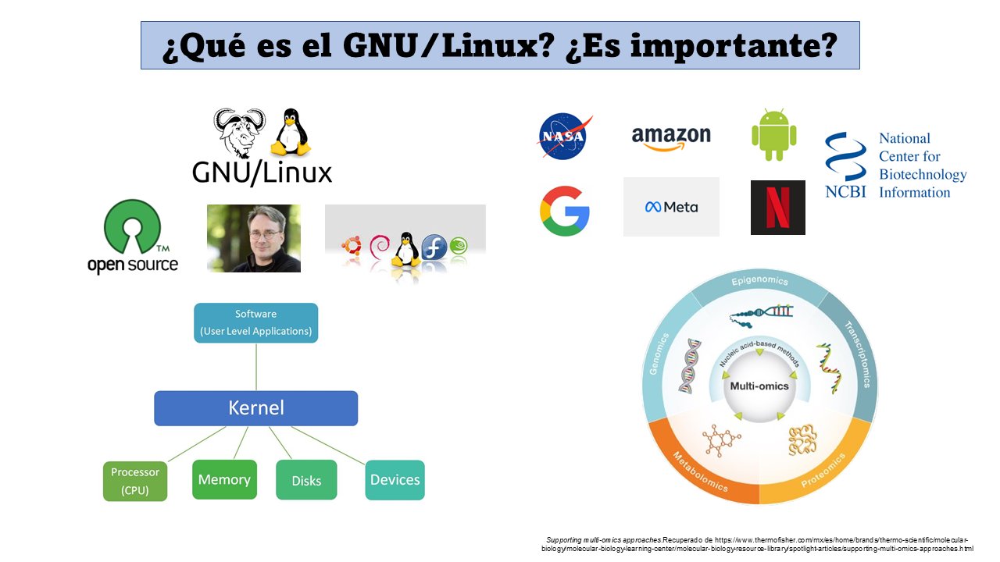
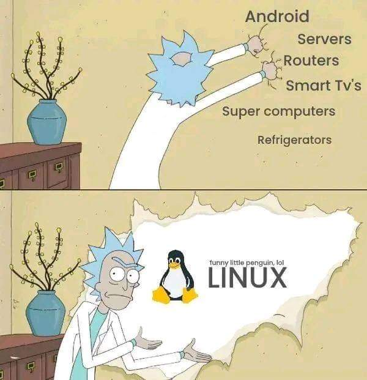

# **Introducción a Linux**

Hola, Mundo.

Hoy hablaremos un poquito sobre **Linux**, de una forma simple pero efectiva.

Linux es un *Kernel*, es decir, es el "núcleo" de un sistema operativo (SO) y es quien regula los recursos de una computadora, la interacción software-hardaware. El kernel de Linux es de código abierto, lo que significa que su código fuente está disponible para ser modificado, mejorado y adaptado a diferentes dispositivos y necesidades.

Si bien estrictamente el verdadero sistema operativo es GNU/Linux, se entiende que **Linux** es un sistema operativo. La acotación importante deberá ser ¿de cuál distribución de Linux estamos hablando? Linux existe en distintas versiones diseñadas para fines diferentes y por ende su funcionamiento puede variar entre distribuciones pese a tener una base común. Este punto común es el sistema operativo UNIX de AT&T, el mismo de Mac OS. Por ende, mucho de lo que se hace en Linux se puede hacer con Mac, lo complejo viene cuando quremos trabajar con Windows. :( 

Si bien Windows es el SO más popular en el mundo, especialmente en equipos personales de compúto, la realidad es que nivel industria Linux tiene mayor presencia en el mercado. **La mayoría de los servidores en el mundo usan Linux, como lo son los servidores de: Google, Amazon, Facebook, NASA e incluso Netflix**. 

Para nosotros resulta importante conocer y manejar aunque sea de una forma básica este sistema... si en algún momento trabajamos con datos de secuenciación masiva, simulación de sistemas complejos, modelado 3D o cualquier tarea que requiera grandes recursos computacionales nuestra computadora personal seguramente no podrá con las tareas. En este escenario necesitaremos conectarnos a un *cluster* o a una *workstation* y los más seguro es que su SO sea Linux. Además, muchas de las herramientas computacionales empleadas en las ciencias omicas están implementadas en Linux. 

En resumen, Linux es un sistema operativo basado en Unix que es ampliamente utilizado en bioinformática por su estabilidad, eficiencia y compatibilidad con herramientas científicas de código abierto. Sus ventajas incluyen:

+ Gratuito y de código abierto: No requiere licencias.
+ Alto rendimiento: Manejo eficiente de recursos computacionales.
+ Compatibilidad: Es el sistema principal en servidores y supercomputadoras utilizadas en análisis bioinformáticos.
+ Automatización: Facilita la ejecución de scripts para procesar grandes volúmenes de datos (NGS, transcriptómica, metagenómica).

En bioinformática podemos usar Linux para:

+ Alineamiento de secuencias (con STAR, HISAT2).
+ Análisis de expresión génica (DESeq2, edgeR).
+ Ensamblaje de genomas (SPAdes, Trinity).

Una de las características de Linux es el uso de la terminal. Aunque el SO  tiene un interfaza gráfica como cualquier otro, realmente Linux se trabaja a través de línea de comandos, en especial porque cuando nos conectamos a un servidor o computadora Linux, no tenemos acceso o no existe la interfaz gráfica. Entonces **¿por qué usar la terminal?**

+ Es más rápida y eficiente.
+ Permite automatizar tareas con scripts.
+ Optimiza el uso de recursos computacionales.

En este curso aprenderemos a usar la terminal para navegar en el sistema, manipular archivos y correr herramientas bioinformáticas.

**Linux es una herramienta poderosa en el mundo de la bioinformática. Aprender a manejar la terminal no solo nos permitirá ejecutar análisis de datos con mayor eficiencia, sino que también nos preparará para trabajar en servidores y clústeres de alto rendimiento.**

En 2024 Linux registró su máximo histórico en usuarios del sistema operativo alcanzando un 4% total de los usarios de PC a nivel mundial. Si bien, este procentaje parece poco, los equipos con este SO son de gran valor en el mercado al igaul que sus usuarios.  La comunidad de Linux es grande, por ello, hay distintos fuentes de las cuales podemos obtener inforación sobre el uso del sistema y sobre todo para resolver errores al momento de programar. Algunas herraminetas para consultar información sobre el sistema y sus elementos son:

+ El manual específico de cada comando.
+ La documentación de los paquetes.
+ Foros de debáte: [Stackoverflow](https://stackoverflow.com/questions), [Biostars](https://www.biostars.org/), etc.
+ Inteligencias Articiales: [Chat GPT](https://openai.com/index/chatgpt/), [Gemini](https://gemini.google.com/), [Deep Seek](https://www.deepseek.com/), etc.

#### **Tips:**

+ Es importante cuidar el nombre de variables, archivos y directorios. Procura que sean breves, descriptivas, que no inicien con mayúsculas ni con números. Pero sobre todo que no contengan espacios, si consideras necesario poner un espacio puedes indicarlo con un guión bajo "_".

+ Siempre realiza un respaldo de tus datos, **que sea lo primero que hagas**.

+ Cuida el redirigir tus salidas, podrías perder información.

+ Es muy importante conocer la computadora, saber sus características te dará una idea de lo que puedes hacer. ¿Qué información se obtiene al ejecutar?

        lscpu

+ Siempre debemos testear nuestros scripts con datos de prueba antes de ejecutarlos con datos reales.

## **Dudas y comentarios**
**¿Linux es importante?**

