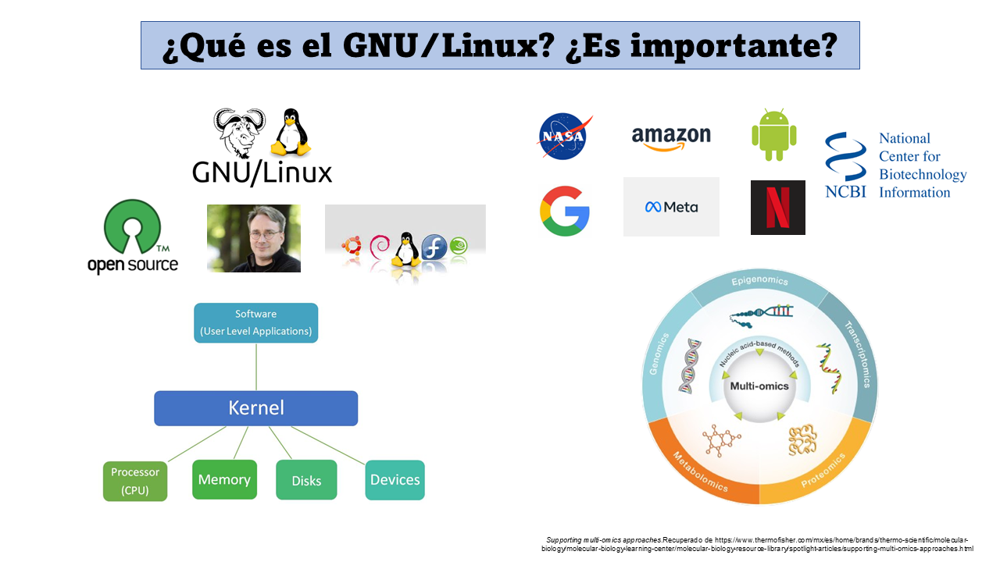

# **Terminal Linux**

### **Introducción**

Hola, Mundo.

Hoy hablaremos un poquito sobre **Linux**, de una forma simple pero efectiva.

Linux es un *Kernel*, es decir, es el "núcleo" de un sistema operativo (SO) y es quien regula los recursos de una computadora, la interacción software-hardaware. El kernel de Linux es de código abierto, lo que significa que su código fuente está disponible para ser modificado, mejorado y adaptado a diferentes dispositivos y necesidades.

Si bien estrictamente el verdadero sistema operativo es GNU/Linux, se entiende que **Linux** es un sistema operativo. La acotación importante deberá ser ¿de cuál distribución de Linux estamos hablando? Linux existe en distintas versiones diseñadas para fines diferentes y por ende su funcionamiento puede variar entre distribuciones pese a tener una base común. Este punto común es el sistema operativo UNIX de AT&T, el mismo de Mac OS. Por ende, mucho de lo que se hace en Linux se puede hacer con Mac, lo complejo viene cuando quremos trabajar con Windows. :( 

Si bien Windows es el SO más popular en el mundo, especialmente en equipos personales de compúto, la realidad es que nivel industria Linux tiene mayor presencia en el mercado. **La mayoría de los servidores en el mundo usan Linux, como lo son los servidores de: Google, Amazon, Facebook, NASA e incluso Netflix**. 

Para nosotros resulta importante conocer y manejar aunque sea de una forma básica este sistema... si en algún momento trabajamos con datos de secuenciación masiva, simulación de sistemas complejos, modelado 3D o cualquier tarea que requiera grandes recursos computacionales nuestra computadora personal seguramente no podrá con las tareas. En este escenario necesitaremos conectarnos a un *cluster* o a una *workstation* y los más seguro es que su SO sea Linux. Además, muchas de las herramientas computacionales empleadas en las ciencias omicas están implementadas en Linux. 

En resumen, Linux es un sistema operativo basado en Unix que es ampliamente utilizado en bioinformática por su estabilidad, eficiencia y compatibilidad con herramientas científicas de código abierto. Sus ventajas incluyen:

+ Gratuito y de código abierto: No requiere licencias.
+ Alto rendimiento: Manejo eficiente de recursos computacionales.
+ Compatibilidad: Es el sistema principal en servidores y supercomputadoras utilizadas en análisis bioinformáticos.
+ Automatización: Facilita la ejecución de scripts para procesar grandes volúmenes de datos (NGS, transcriptómica, metagenómica).

En bioinformática podemos usar Linux para:

+ Alineamiento de secuencias (con STAR, HISAT2).
+ Análisis de expresión génica (DESeq2, edgeR).
+ Ensamblaje de genomas (SPAdes, Trinity).

Una de las características de Linux es el uso de la terminal. Aunque el SO  tiene un interfaza gráfica como cualquier otro, realmente Linux se trabaja a través de línea de comandos, en especial porque cuando nos conectamos a un servidor o computadora Linux, no tenemos acceso o no existe la interfaz gráfica. Entonces **¿por qué usar la terminal?**

+ Es más rápida y eficiente.
+ Permite automatizar tareas con scripts.
+ Optimiza el uso de recursos computacionales.

En este curso aprenderemos a usar la terminal para navegar en el sistema, manipular archivos y correr herramientas bioinformáticas.

**Linux es una herramienta poderosa en el mundo de la bioinformática. Aprender a manejar la terminal no solo nos permitirá ejecutar análisis de datos con mayor eficiencia, sino que también nos preparará para trabajar en servidores y clústeres de alto rendimiento.**

En 2024 Linux registró su máximo histórico en usuarios del sistema operativo alcanzando un 4% total de los usarios de PC a nivel mundial. Si bien, este procentaje parece poco, los equipos con este SO son de gran valor en el mercado al igaul que sus usuarios.  La comunidad de Linux es grande, por ello, hay distintos fuentes de las cuales podemos obtener inforación sobre el uso del sistema y sobre todo para resolver errores al momento de programar. Algunas herraminetas para consultar información sobre el sistema y sus elementos son:

+ El manual específico de cada comando.
+ La documentación de los paquetes.
+ Foros de debáte: [Stackoverflow](https://stackoverflow.com/questions), [Biostars](https://www.biostars.org/), etc.
+ Inteligencias Articiales: [Chat GPT](https://openai.com/index/chatgpt/), [Gemini](https://gemini.google.com/), [Deep Seek](https://www.deepseek.com/), etc.

----

### **Trabajando en la terminal:**

La terminal es una interfaz de línea de comandos (CLI) que permite interactuar con el sistema operativo escribiendo instrucciones en texto. A diferencia de las interfaces gráficas, la terminal es más eficiente para:

+ Procesar archivos grandes.
+ Automatizar tareas con scripts.
+ Conectar con servidores remotos. 

Nota: las salidas que verán son un ejemplo, corresponden a mi equipo y por ende tú tendrás una distinta en comandos que dependen del contexto de la computadora. En esta guía los comandos a ejecutar los verás en una especie de caja, podrás copiarlos y pegarlos directamente en tu computadora. Además, la salida se representa después del signo ">" a manera de ejemplo. Tú verás la salida en tu terminal. 

El objetivo es que se sientan confiados al enfrentarse a un equipo con Linux como sistema operativo. Para ello veremos como movernos en la terminal, generar archivos, ejecutar script's y algunos otros tips que les puedan resultarles útiles. 

**Lo primero que deben saber es lo siguiente: la terminal funciona a través de comandos. Los comandos son instrucciones que el usuario introduce en la terminal para realizar acciones. La estructura básica de un comando es la siguiente:** 

    comando [opciones] [argumentos]
---
    ls -lh /home/
---    
    > total 4.0K
    drwxr-x--- 17 jrmarval jrmarval 4.0K Feb 24 16:36 jrmarval

En esta estructura el comando es la acción a realizar, las opciones modifican el comportamiento del comando y los argumentos representan los elementos sobre los que actuará ese comando.

Ahora, cuando abrimos la terminal entramos a un directorio (directorio=carpeta) pero no sabemos a cual. Entonces, para saber en que directorio nos situamos podemos ejecutar el comando *pwd* el cual **va imprimir el directorio actual de trabajo:**
    
    pwd
---
    > /home/jrmarval 

**Tip:** esto también es útil para especificar rutas en nuestros comandos o scripts.

Para tener un orden en nuestra computadora y en este curso, vamos a crear una carpeta para almacenar todos los archivos que vayamos generando. Para hacer esto usaremos el comando *mkdir*:

    mkdir curso_bioinfo

Cuando corran este comando no verán alguna salida pero el directorio ya fue generado. Si queremos ver los elementos que están en un directorio usamos el comando *ls*

    ls
---
    > [Elementos presentes en el directorio]

    ls -lh
    total 68K

    drwxr-xr-x 7 jrmarval jrmarval 4.0K Jun 11  2024 Bioinfo_Inmunologia2023
    drwxr-xr-x 5 jrmarval jrmarval 4.0K Feb 22 11:36 Cursos_Bioinfo_MARVAL
    drwxr-xr-x 9 jrmarval jrmarval 4.0K Nov  9  2023 RNAseq_uivc
    drwxr-xr-x 5 jrmarval jrmarval 4.0K Nov 19 17:58 Transcriptomics_UIVC
    -rw-r--r-- 1 jrmarval jrmarval  20K Aug 29 23:05 bitacora.md
    drwxr-xr-x 4 jrmarval jrmarval 4.0K Sep 18 15:12 ciencia_computacional
    drwxr-xr-x 2 jrmarval jrmarval 4.0K Feb 24 17:37 curso_bioinfo
    drwxr-xr-x 2 jrmarval jrmarval 4.0K Jan 29 17:45 general
    drwxr-xr-x 2 jrmarval jrmarval 4.0K Jan 23 22:31 linux_cbiol
    drwxr-xr-x 4 jrmarval jrmarval 4.0K Nov  5 22:18 linux_ib
    drwxr-xr-x 6 jrmarval jrmarval 4.0K Sep 24 22:00 rnaseq_ccg
    drwxr-xr-x 4 jrmarval jrmarval 4.0K Feb 17 09:01 scRNAseq_marval
    drwxr-xr-x 7 jrmarval jrmarval 4.0K Nov 21 13:46 test_rnaseq

Como vemos nuestro directorio **curso_bioinfo** fue creado. Ahora para movernos entre directorios usamos el comando *cd*. Veremos que el prompt muestra el nombre del directorio actual de trabajo.

    > (base) jrmarval@LAPTOP-8SI0DC1R:~/marval$
---

    cd curso_bioinfo
---
    > (base) jrmarval@LAPTOP-8SI0DC1R:~/marval/curso_bioinfo$

Si queremos regresar al directorio anterior ejecutamos:

    cd ..
---
    > (base) jrmarval@LAPTOP-8SI0DC1R:~/marval$

Si quisieramos movernos a una ruta en especial podemos indicar la ruta destino en un solo comando:

    cd /rutadestino

**¿Qué pasa cuándo se ejecuta?¿Cúal es la diferencia?**

    cd -
---
    cd --

En esencia, Linux es un conjunto de directorios, en los cuales cada uno de ellos alberga un contenido determinado para el sistema operativo. La [estructura de directorios en Linux](https://itsfoss.com/es/estructura-directorios-linux/) es la siguiente:

En programación es usual hablar de rutas absolutas y relativas ¿puedes imaginar cuál es la diferencia?

    pwd
    > /home/jrmarval/marval/curso_bioinfo
---
    cd ../ciencia_computacional

¿Cómo se comportan estas dos líneas de código?

---

Ahora que estamos dentro de nuestro directorio de trabajo sería bueno crear un archivo. Para ello usaremos un editor de texto plano, algo así como un Word-Office pero versión sencilla para la terminal. Existen varias herramientas, pero nosotros usaremos *nano*. Vamos a generar dos archivos para seguir con los ejercicios.  

    nano file1.txt
---
    nano file2.txt

Lo anterior abre una ventana en la que podemos escribir todo lo que nos podamos imaginar. Para visualizarlos de una forma sencilla usamos el comando *less*.

    less lorem_ipsum.txt

Esta forma de visualización nos abre una venana emergente en nuestra terminal en la cual podemos observar bloques grandes de nuestro archivo. También, podemos visualizar el contenido de nuestro archivo directamente en la terminal con el comando *cat*:

    cat lorep_ipsum.tx

Existen otras formas de visualizar el contenido de nuestros archivos como:

    head lorem_ipsum.txt
---
    head -n 2 lorem_ipsum.txt

Si lo que deseamos es ver el final de nuestro archivo esto también es posible. Para esto usamos elm comando *tail*:

    tail lorem_ipsum.txt
---
    tail -n 2 lorem_ipsum.txt

Todas estas formas de ver el contenido de nuestro archivo, únicamente son eso, una forma de verlos, **no tenemos la capacidad de editarlos**, para ello hay que abrir de nnuevo el archivo con el editor de texto *nano.*

Es importante cuidar la extensión del archivo, pues esto determina las características del mismo. Podemos tener un archivo de texto plano (txt), algún script ejecutable para Bash (.sh) o Python (.py). **Muchas veces no es necesario indicar la extensión, pero hacerlo es una buena práctica para identificar el tipo de archivos con mayor facilidad, así que tratemos de hacerlo siempre.** 

Una parte importante del crear algo es tener la capacidad de poderlo borrar y para ello tenemos el comando *rm*.

    rm file1.txt 

**Tip:** si te un día debes enseñarle Linux a otra persona, dale el comando *rm -i* ¿Cómo se comportar este comando? 

Para eliminar un directorio con los elementos que estén en el, debemos hacerlo agregando una opción al comando anterior.

    rm -r curso_bioinfo

**¡Cuidado! En la terminal no existe la "papelera" por lo que debemos ser muy cuidadosos cuando queramos borrar algo, una vez eliminado no hay vuelta atrás.**

**Ejercicio:**
Genera de nuevo el fichero *curso_bioinfo* y escribe 6 archivos, 3 con la terminación txt y otros 3 con csv. 
Ahora, debes eliminar únicamente los ".txt" ¿Cómo lo harías?¿Cómo lo resolviste?¿Si borraste uno por uno lo harías de la misma forma si hay que hacerlo para 100 archivos?

**Tip: wildcard "*"**

Los wildcards (comodines) son caracteres especiales que te permiten hacer coincidir múltiples archivos o patrones en comandos de terminal. Son muy útiles cuando quieres trabajar con varios archivos a la vez sin escribir cada nombre manualmente.

El comodín "*", hace coincidir cualquier número de caracteres:

    ls *.txt       # Lista todos los archivos que terminan en .txt

    rm file*       # Borra todos los archivos que empiezan con "file"

    cp * backup/   # Copia todos los archivos al directorio "backup/"

El comodín "?" sustituye un solo carácter:

    ls file?.txt   # Coincide con file1.txt, file2.txt, pero NO con file10.txt
    
    cp doc?.pdf backup/  # Copia archivos como doc1.pdf, doc2.pdf, etc.

El comodín "[]" coincide con un conjunto de caracteres específicos:

    ls file[123].txt   # Coincide con file1.txt, file2.txt y file3.txt, pero NO con file4.txt
    
    ls file[a-c].txt   # Coincide con filea.txt, fileb.txt, filec.txt

El comodín "{}" genera una lista de opciones separadas por comas:

    echo {a,b,c}.txt   # Expande a: a.txt b.txt c.txt
    
    mkdir {backup,logs,output}  # Crea tres carpetas: backup, logs y output

El comodín "{}" también se puede utilizar con un rango de valores:

    nano file{1..5}.txt  # Crea file1.txt, file2.txt, file3.txt, file4.txt, file5.txt

    mv image{01..10}.jpg backup/  # Mueve image01.jpg a image10.jpg al directorio backup/

Otra función importante y que nos ayudará a proteger nuestra información es realizar copias de nuestros archivos. Para copiar un archivo usamos el comando *cp*:

    cp file1.txt /direcorio_destino

Pero si lo que queremos es solo cambiar la ubicación de un archivo empleamos el comando *mv*:

    mv file1.txt curso_bioinfo

Este comando también sirve para cambiar el nombre de un archivo, en este caso en lugar de indicar la ruta destino deberemos indicar el nuevo nombre del archivo:

    mv file1.txt new_file1.txt

Debemos tener cuidado de copiar o mover archivos con nombres idénticos a algún otro archivo en el directorio destino, pues esto sobreescribirá la información del archivo residente y podríamos perder la información original. 

Para tener más claro la idea de sobrescribir un archivo en Linux hagamos lo siguiente. Escribe "Hola" en un archivo test.txt.

    nano test.txt

Ahora pongamos:

    echo "adios" > test.txt

¿Qué sucedió? ¿Qué hace el comando *echo*?
Ahora escribe:

    echo "Hola, de nuevo" >> test.txt

¿Ahora qué sucede?

Hasta este punto hemos visto como crear un directorio, entrar y salir de él, añadir archivos. Aprovechando que hay un par de archivos en nuestro directorio de trabajo, vamos a retomar el comando *ls* para listar los archivos presentes:

    ls 
---
    > bioinfo_linux.png  ejercicio_if        estructura_directorio.jpg mexico.jpg
    ejercicio_for.sh ejercicio_while.sh linux.jpg  readme.md

De esta forma solo podemos ver los elemtnos presentes en el directorio de trabajo. Sin embargo, añadiendo algunas opciones podemos obtener más informacíón con el mismo comando. Para conocer las opciones del comando ejecuta:

    man ls
---
    ls -lha
---
    > total 84K
    drwxr-xr-x 14 jrmarval jrmarval 4.0K Feb 24 17:37 .
    drwxr-x--- 17 jrmarval jrmarval 4.0K Feb 25 10:30 ..
    -rw-r--r--  1 jrmarval jrmarval   52 Nov 13 02:10 .git.txt
    drwxr-xr-x  5 jrmarval jrmarval 4.0K Feb 22 11:36 Cursos_Bioinfo_MARVAL
    drwxr-xr-x  9 jrmarval jrmarval 4.0K Nov  9  2023 RNAseq_uivc
    drwxr-xr-x  5 jrmarval jrmarval 4.0K Nov 19 17:58 Transcriptomics_UIVC
    -rw-r--r--  1 jrmarval jrmarval  20K Aug 29 23:05 bitacora.md
    drwxr-xr-x  4 jrmarval jrmarval 4.0K Sep 18 15:12 ciencia_computacional
    drwxr-xr-x  2 jrmarval jrmarval 4.0K Feb 25 08:52 curso_bioinfo
    drwxr-xr-x  2 jrmarval jrmarval 4.0K Jan 29 17:45 general
    drwxr-xr-x  2 jrmarval jrmarval 4.0K Jan 23 22:31 linux_cbiol
    drwxr-xr-x  4 jrmarval jrmarval 4.0K Nov  5 22:18 linux_ib
    drwxr-xr-x  6 jrmarval jrmarval 4.0K Sep 24 22:00 rnaseq_ccg
    drwxr-xr-x  4 jrmarval jrmarval 4.0K Feb 17 09:01 scRNAseq_marval
    drwxr-xr-x  7 jrmarval jrmarval 4.0K Nov 21 13:46 test_rnaseq

Ejecuta el comando ls -lha, paso a paso, es decir, ve añadiendo cada una de las opcines (lha) y observa las diferencias 

¿El archivo .git.txt tiene algo de particular? Sí, lo tiene y es que inicia con un ".", esto pareciera insignificante 

En nuestra salida vemos un conjunto de carácteres que nos brindan información sobre los archivos y directorios, en específico, lo que podemos hacerles y quiénes pueden hacerlo. En Linux, cada archivo y directorio tiene tres niveles de permisos:

+ Usuario (owner) → El dueño del archivo.
+ Grupo (group) → Otros usuarios del mismo grupo.
+ Otros (others) → Todos los demás usuarios.

Cada nivel de permisos tiene tres tipos de acceso:

    Lectura (r) → 4
    Escritura (w) → 2
    Ejecución (x) → 1

Para asignar permisos, sumamos estos valores:

+ 7 → (4+2+1) → rwx (lectura, escritura y ejecución).
+ 6 → (4+2) → rw- (lectura y escritura, sin ejecución).
+ 5 → (4+1) → r-x (lectura y ejecución, sin escritura).
+ 4 → (4) → r-- (solo lectura).
+ 0 → Sin permisos (---).

Entonces, con esta información ¿qué hará el siguente comando?

    chmod 777 saludo.txt
---
    ls -lh saludo.txt
    > -rw-r--r-- 1 jrmarval jrmarval   21 Feb 25 10:48 saludo.txt
---
    ls -lh saludo.txt
    > -rwxrwxrwx 1 jrmarval jrmarval   21 Feb 25 10:48 saludo.txt

Ahora veamos como cambiar el propietario pero primero debemos crear un nuevo grupo:

    sudo groupadd bio_grupo

Para verificar que se genero el grupo:

    getent group | grep bio_grupo
---
    > bio_grupo:x:1001:

Ahora procedemos a crear un nuevo usario:

    sudo useradd -m -G bio_grupo -s /bin/bash bioinfo_user

Explicación de los parámetros:

+ -m : Crea automáticamente un directorio /home/bioinfo_user.
+ -G bio_grupo : Asigna el usuario al grupo bio_grupo.
+ -s /bin/bash : Le da acceso a la terminal Bash.

Verificamos la creación del grupo y del usuario:

    id bioinfo_user
---
    > uid=1001(bioinfo_user) gid=1002(bioinfo_user) groups=1002(bioinfo_user),1001(bio_grupo)
---
    getent group bio_grupo
---
    > bio_grupo:x:1001:bioinfo_user

Ahora si vamos a cambiar el propietario y grupo de un archivo.

    ls -lh
---
    > -rwxrwxrwx 1 jrmarval jrmarval   21 Feb 25 10:48 saludo.txt

Para ello ejecuta:

    sudo chown bioinfo_user:bio_grupo saludo.txt
---
    ls -lh
---
    > -rwxrwxrwx 1 bioinfo_user bio_grupo   21 Feb 25 10:48 saludo.txt

Finalmente vamos a trabajar un poco la edición de archivos en Linux. Para ello usaremos como ejemplo el archivo salmon.tsv el cual contiene infromación sobre los transcritos de una muestra RNAseq procesada con el mapeador [Salmon](https://combine-lab.github.io/salmon/).

+ Primero vean el archivo ¿Qué comando podrían usar para consultar el contenido del archivo?

El comando *awk* es útil para manejar columnas. Por ejemplo, si queremos extraer alguna columna en específico:

    awk '{print $1}' salmon.tsv

De tal fomra que puedo extraer las columnas de mi interés y guardarlas en otor archivo:

     awk '{print $1, $4}' salmon.tsv > test_awk.tsv
---

Con awk también es posible hacer filtrar los datos. Por ejemplo, conservar solo los transcritos obervados:

    awk '$4 > 0' salmon.tsv > expresados.tsv

Ahora vamos a buscaar patrones de texto, lo cual se puede hacer con el comando *grep*:

    grep "ENST00000456328" salmon.tsv
---
    grep -v "0.000000" salmon.tsv

Aquí la opción "-v" invierte la búsqueda, es decir, en lugar de conservar las líneas con el patrón de interés, las elimina. 

Ejercicio: determina cuántos transcritos tienen un nivel de expresión mayor a 0 TPM en el archivo Salmon.
Tip: busca el comando *wc*.

    grep -vc "0.000000" salmon.tsv

También podemos ordenar los archivos por algún tipo de orden, ya sea númerico o alfabético con el comando *sort*:

    sort -k4,4nr salmon.tsv | column -t | head -n 20
---
    sort -k5,5n salmon.tsv | column -t | head -n 20
---
    sort -k1,1 salmon.tsv | column -t | head -n 20
---
    sort -k1,1r salmon.tsv | column -t | head -n 20

Lo elementos repetidos son un dolor de cabeza en cualquier lenguaje de programación. En Linux podemos emplear *uniq* para remover elementos repetidos. En este caso no usaremos el archivo salmon.tsv dado que no tiene elementos repetidos. Pero podemos crear un archivo más ilutrativo para este comando:

    echo -e "manzana\nbanana\nmanzana\npera\nbanana\nnaranja\nmanzana" > frutas.txt
---
    cat frutas.txt
---
    > manzana
    banana
    manzana
    pera
    banana
    naranja
    manzana
---
    sort frutas.txt | uniq -c
---
    > 2 banana
      3 manzana
      1 naranja
      1 pera
---
     sort frutas.txt | uniq
---
    > banana
      manzana
      naranja
      pera

Si queremos encontrar un archivo cuya ubicación desconocemos podemos usar el comando *find*:

    find / -name "salmon.tsv" 2>/dev/null
---
    > /home/jrmarval/marval/curso_bioinfo/salmon.tsv
      /home/jrmarval/marval/Cursos_Bioinfo_MARVAL/linux/salmon.tsv

**Hasta este punto hemos visto algunos de los comandos básicos del shell de Linux que te ayudarán a manejarte fácilmente en la terminal y gestionar archivos.**

*Si tienen alguna duda o comentario...hablen ahora o callen para siempre.*

---

### **Bash Script**

Como habrás notado puedes hacer tareas directamente en la terminal pero cuando tengas una tarea mayor y repetitiva frente a ti no es tan buena idea introducir el comando *n* cantidad de veces, esperando a que termine un proceso para ingresar el siguiente comando. Podemos hacer que la computadora trabaje para nosotros al unificar la secuencia de comandos y ejecutarlos al mismo tiempo. Así podríamos irnos a casa mientras la computadora trabaja.   

Automatizar un proceso es posible gracias a los **scripts**, un archivo ejecutable por un lenguaje de programación como R, Python o Bash. En el caso de Linux el empleado por el SO es Bash, si quieres saber que interprete de Shell (comandos por terminal) tiene tu equipo simplemente ejecuta:

    echo $SHELL

Para crear un script de Bash usamos el editor de textos *nano* y lo guardamos con la extensión sh.

    nano mi_primer_script.sh

Una vez dentro del editor escribimos:

    #!/bin/bash
    echo "Hola, $USER"

Para ejecutar el el script:

    ./mi_primer_script.sh

**¿Cuál es el resultado? ¿El script funcionó? ¿Tiene idea de que pasó? ¿Comó defines $USER?**

Recordemos que Linux es un sistema multiusuario, es decir, varias personas pueden estar trabajando en él al mismo tiempo por lo que la gestión de recursos y de permisos es un aspecto clave. Para resolver esto, hay todo un sistema de permisos que te permiten realizar ciertas tareas. Veamos esto de forma práctica ejecutando:

    ls -lh
---

    drwxr-xr-x  4 jrmarval jrmarval 4.0K Nov  7 21:28 evo_helena

    drwxr-xr-x  5 jrmarval jrmarval 4.0K Dec  2 03:53 marval

    -rwx------  1 jrmarval jrmarval   33 Dec  2 13:30 mi_primer_scrip.sh

    drwxr-xr-x 19 jrmarval jrmarval 4.0K Oct 23 01:59 miniconda3

    drwx------  3 jrmarval jrmarval 4.0K Oct 26 11:09 snap

    drwxr-xr-x  2 jrmarval jrmarval 4.0K Oct 23 01:58 software

    ----------  1 jrmarval jrmarval   67 Nov 15 11:32 time.sh

Este comando nos enlista los elementos del directorio actual de trabajo, pero también nos indica si se trata de un directorio o de un archivo. Además, nos indica los permisos que tiene cada uno de los elementos. Esto esta codificado en tercias que corresponden a la actividad a realizar; **x:ejecutar | r:leer | w:escribir**. Esto es aplicable para tres tipos de usarios: propietario, grupos y otros.

Para dar los permisos de ejecución a un archivo se usa un código numérico.

    Leer        | 4
    Escribir    | 2
    Ejecutar    | 1

Por ejemplo, si queremos que un script tenga todos los permisos para todos los usuarios ejecutamos:

    chmod 777 time.sh
    ls -lh

    -rwxrwxrwx  1 jrmarval jrmarval   67 Nov 15 11:32 time.sh

Ahora, modifica los permisos necesarios para que solo tú (propietario) puedas ejecutar el archivo mi_primer_script.sh y verifica que los permisos hayan cambiado. Una vez hecho esto, ejecuta el script.

    ./mi_primer_script.sh

¿Qué será $USER? Se trata de una variable de entorno GLOBAL que contiene el usuario del sistema. El punto importante aquí es que podemos declarar variables (un contenedor de información) en Linux para mejorar nuestros programas. Editando un poco nuestro script:

    #!/bin/bash
    echo "Hola, $1"

¿Cuál será la salida? Pues en efecto será un saludo con el contenido de la variable $1, la cual se define en la línea de comandos:

    ./mi_primer_script.sh tu_nombre
---
    > Hola, tu_nombre

Ahora si quieres saber cuánto tiempo tardó en ejecutarse tu script puedes correr:

    time ./mi_primer_script.sh 

Con este ejemplo no verás muchas diferencias porque el proceso es muy rápido, pero en tareas que toman mucho tiempo, saber cuánto tarda en ejecutarse un proceso es muy útil para optimizar nuestro trabajo (por ejemplo, el ensamble de secuencias de RNASeq o Genoma podría demorar mucho tiempo. Esto también depende de los recursos computacionales con los que cuentes). Veamos el siguiente script:

    #!/bin/bash 
    # Obtener la fecha actual
    DATE=$(date)
    echo "El script inicia $DATE"
    echo  Hola, $1
    sleep 10
    # Obtener la fecha nuevamente
    DATE=$(date)
    echo Oye $1, el proceso ha terminado $DATE

¿Qué hace y cómo se comporta este script?

Cuando lanzamos un proceso que toma tiempo la terminal queda "secuestrada", lo cual es un impedimento para seguir trabajando. Para ello podemos lanzar el script en segundo plano:

    nohup ./mi_primer_scrip.sh Raul &

    nohup ./mi_primer_scrip.sh Raul  > salida.txt 2> errores.txt &

¿Cuál es la diferencia entre estas dos maneras de ejecutar el scrip?

 Cada proceso genera un PID (Identificador de Procesos) y este puede ser rastreado para saber si mi proceso sigue en ejecución.
    
    ps -p <PID>
---
    ps aux | grep <PID>

Para ver todos los procesos de la computadora usamos el comando *top*.
Así como tenemos la capacidad de ejecutar procesos, también podemos deternerlos. Para ello requerimos conocer su PID y ejecutar el siguiente comando:

    kill -9 <PID>

Finalmente, veremos los *loops/ciclos/bucles* una manera de optimizar nuestros procesos, son una declaración de iteración lo cual esto es realmente útil para tareas repetitivas. 

El primero ciclo que veremos será el *for*,  este realiza una tarea para una variable en un conjunto de elementos. 

    #!/bin/bash
    for i in 1 2 3 4 5; do
    echo "Hello $i"
    done

---

    #!/bin/bash
    # Ciclo for que imprime los números del 1 al $1
    for ((i = 1; i <= $1; i++)); do
        echo "Número: $i"
    done
    echo Ciclo finalizado. 

---

    #!/bin/bash
    for i in * ; do
        echo He trabajado con el archivo = $i
    done

También existen ciclos condicionales, es decir, que se realizan solo si se cumple con una condición y en caso de no hacerlo se realiza otra tarea. Por ejemplo: 

    #!/bin/bash

    # Ejemplo para emitir un mensaje con base en una condición

    edad=$1
    if [ $edad -ge 18 ]; then
        echo "Eres mayor de edad."
    else
        echo "Eres menor de edad."
    fi

[Material sobre Operadores](https://medium.com/enredando-con-linux/linux-shell-operadores-8f385713e8ad) 

Otro tipo de ciclo importante es el *while*, el cual ejecuta una función mientras una condición sea verdadera:

    #!/bin/bash
    # Inicializar un contador
    contador=1
    # Ciclo while que cuenta hasta $1
    while [ $contador -le $1 ]; do
        echo "Contador: $contador"
        ((contador++))
    done

---

### **Ejercicio:** 

1. Crea una carpeta llamada loop_for; coloca una imagen en ella y ponle el nombre que tú quieras. Ahora deberás generar esa imagen 5 veces usando el nombre que le diste como prefijo, seguida de un número (1-5) para distinguir cada imagen. Después deberás ponerlas en un fichero llamado new_name, pero ahora las imágenes llevaran el prefijo "figura" seguido del número que le corresponde. Realiza un script para esto y entre más automatizado se encuentre muchísimo mejor. 

2. Escribe un script que realice la tarea que tú quieras pero deberás emplear un ciclo *if* y/o *while*.

**Nota:** la computadora no piensa, solo hace cosas y a veces esas cosas no son las que queremos. 

---

### **Tips:**

+ Es importante cuidar el nombre de variables, archivos y directorios. Procura que sean breves, descriptivas, que no inicien con mayúsculas ni con números. Pero sobre todo que no contengan espacios, si consideras necesario poner un espacio puedes indicarlo con un guión bajo "_".

+ Siempre realiza un respaldo de tus datos, que sea lo primero que hagas.

+ Cuida el redirigir tus salidas, podrías perder información.

+ Es muy importante conocer la computadora, saber sus características te dará una idea de lo que puedes hacer. ¿Qué información se obtiene al ejecutar?

        lscpu

+ Siempre debemos  testear nuestros scripts con datos de prueba antes de ejecutarlos con datos reales.

## **Dudas y comentarios**
**¿Linux es importante?**

